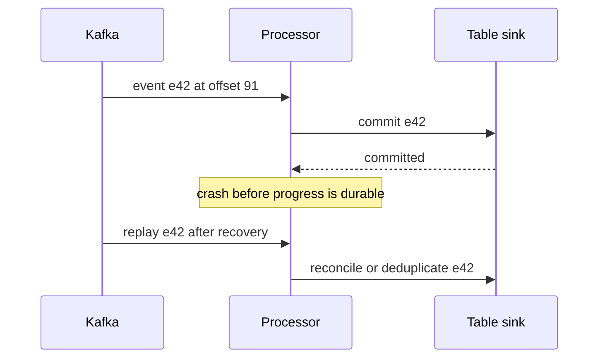

# Kafka, CDC, and streaming recovery

Streaming correctness becomes visible when a process stops between reading an event and committing its output. Design for that interruption before optimizing throughput.

## Terms introduced in this chapter

| Term | Meaning |
|---|---|
| Partition / offset | An ordered log segment / a position within it |
| Consumer group | Consumers sharing partition consumption responsibility |
| Rebalance | A change in partition assignments among consumers |
| CDC | Change Data Capture: turning database changes into records for downstream use |
| Event time / processing time | When the event occurred / when a processor handled it |
| Watermark | An event-time progress boundary used by supported stateful operations |
| Checkpoint | Recorded progress and state needed for a processor to recover |

## Understand the model first

1. The producer chooses a partition, often using a key that preserves a desired ordering scope.
2. Kafka appends records under its configured acknowledgement and replication policy.
3. A consumer or stream processor reads positions and updates state.
4. The output sink commits a durable result.
5. Recovery resumes from recorded progress and handles records that may be read again.

Kafka ordering is partition-scoped. More partitions do not create a global order, and increasing partitions can change how a partitioner maps keys. `acks`, replication, and the in-sync replica policy address broker durability; producer idempotence addresses eligible retry duplicates. Neither automatically makes a database write or HTTP side effect exactly once.

## Draw the transaction boundary

Kafka transactions support coordinated Kafka output and consumed offsets under the required consumer behavior. An external sink needs its own compatible transaction or idempotency protocol. Spark's sink documentation explicitly distinguishes guarantees: its Kafka sink is at-least-once, and `foreachBatch` defaults to at-least-once unless the implementation deduplicates appropriately. A checkpoint alone is not a universal exactly-once switch.

## CDC requires a source contract

Debezium's PostgreSQL connector reads an initial snapshot and database changes through logical decoding. Learn replication slots, WAL retention, source positions, transaction metadata, delete events, and restart behavior. A stopped connector can leave WAL retained at the source; monitor that storage risk separately from Kafka consumer lag.

An order event emitted by application code has business meaning. A changed database row has storage meaning. Decide how inserts, updates, deletes, transaction boundaries, and source re-snapshots map into downstream records. Preserve source identifiers so overlap between snapshot and change processing can be reconciled.

A schema registry checks a configured compatibility policy. It cannot infer that an unchanged integer field switched from cents to dollars. Version units and business meaning in the data contract, and test old and new consumers during a migration.

## Event time and state

Suppose an event occurred at 10:01 but arrived at 10:12. Its effect on the 10:00–10:05 aggregate depends on your lateness policy and the processor's operator/output mode. A watermark is progress inferred from observed event times and configuration; it is not proof that all producers have sent everything. Quiet partitions, clock errors, and out-of-order records need explicit handling.

Spark Structured Streaming provides an incremental DataFrame model, commonly using micro-batches. Flink adds a useful comparison in continuous event-time processing, watermarks, keyed state, and checkpointing. Choose through measured latency, state size, connector behavior, and operational capacity; neither name guarantees end-to-end semantics.

## Guided failure matrix

Use an isolated topic, synthetic event IDs, a disposable sink, and an independent expected ledger. Do not delete a real checkpoint as a troubleshooting shortcut.

| Change | Expected evidence and recovery check |
|---|---|
| Stop the consumer | Lag rises; after restart compare distinct eligible IDs and output values |
| Crash after sink commit | Replay occurs; output is reconciled without duplicate business effects |
| Send duplicate and conflicting IDs | Identical retry is handled; conflicting payload has an explicit outcome |
| Send late events | Record accepted, corrected, or rejected counts under the declared policy |
| Break a schema field | Quarantine or fail with a reason, then repair and replay |
| Lose a disposable checkpoint | Restore from a known checkpoint or start a deliberately reconciled replay |
| Exhaust source retention | Report an unrecoverable gap or restore from an independent source copy |

Observe input rate, processing rate, event-to-publication latency, state size, retries, checkpoint age, and sink commits together. Zero Kafka lag does not prove a mart is current: downstream processing or publication may still be stuck.

## Explain it in your own words

Where are your offsets and output committed, and what happens if the process dies between them? Explain why a dead-letter queue needs ownership, retention, a repair procedure, and a tested replay path. Moving a record into a DLQ records a failure; it does not resolve it.

Continue with [modeling and orchestration](07-modeling-orchestration.md).

<!-- source: https://kafka.apache.org/41/design/design/ | checked: 2026-09-10 | Kafka 4.1 delivery and ordering boundaries -->
<!-- source: https://spark.apache.org/docs/latest/streaming/apis-on-dataframes-and-datasets.html | checked: 2026-09-10 | sink guarantees and checkpoint recovery -->
<!-- source: https://debezium.io/documentation/reference/stable/connectors/postgresql.html | checked: 2026-09-10 | snapshot, replication slots and WAL -->
<!-- source: https://nightlies.apache.org/flink/flink-docs-stable/docs/concepts/time/ | checked: 2026-09-10 | event time and watermarks -->
