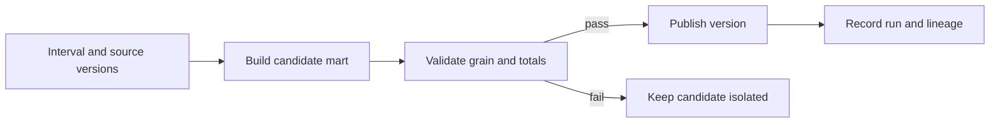

# Modeling, dbt, and orchestration: publish a meaningful dataset

Raw records become a product when consumers can depend on their grain, history, definitions, and delivery. A scheduler that finishes successfully has not established those properties.

## Terms introduced in this chapter

| Term | Meaning |
|---|---|
| Fact / dimension | A measurement or event / descriptive context used to interpret it |
| Star schema | Facts connected to descriptive dimensions through defined keys |
| SCD Type 1 / Type 2 | Replace prior descriptive values / retain their effective history |
| Incremental model | A model that processes a selected change set rather than always rebuilding everything |
| Backfill | Reprocessing a defined historical interval |
| Data interval | The time range a scheduled computation is responsible for |

## Understand the model first

1. Preserve a raw representation with source identities.
2. Standardize types, timestamps, units, and event versions in staging.
3. Build reusable transformations in intermediate models.
4. Publish facts, dimensions, and marts with explicit consumer definitions.
5. Gate publication on checks, then record the input versions and output identity.

Bronze, silver, and gold are organizational conventions. They do not enforce quality by naming a directory. Define each boundary: what is preserved, what is rejected, how historical corrections propagate, and who can read it.

## Build history deliberately

A fact at order-line grain can answer item revenue; a daily aggregate cannot necessarily reconstruct each order. Declare the grain before adding columns. For Type 2 dimensions, join a fact's event time against a non-overlapping validity interval, commonly using a half-open interval. Decide whether reports should reflect historical attribution or today's classification.

Consider a customer who moves regions on Tuesday. A Monday order may belong to Monday's region for historical reporting but today's region for a current-account view. Both can be useful; a single undocumented join cannot safely stand for both definitions.

## dbt's role

`ref` connects model dependencies and relation names; `source` identifies external inputs. Models express transformations, macros share SQL-generation logic, snapshots support change-history workflows, and documentation explains meaning. Adapter and warehouse behavior determine available materializations and constraints.

A model contract describes output shape and supported constraints. A data test evaluates content and reports failing records after the relation exists. Declaring a primary key in a warehouse does not necessarily enforce uniqueness; inspect the adapter and platform behavior and retain an explicit uniqueness test where needed.

Here is an illustrative dbt model property file. It assumes an existing `fct_orders` model with these columns and a compatible dbt/adapter version. It is not a complete project:

```yaml
version: 2
models:
  - name: fct_orders
    description: One accepted current record per order event.
    columns:
      - name: event_id
        data_tests:
          - not_null
          - unique
      - name: amount_cents
        data_tests:
          - not_null
```

These checks do not validate currency, revenue definition, missing upstream events, or update history. Add fixture-based business tests, source reconciliation, and delivery checks for those questions.

## Orchestrate intervals, not wall-clock guesses

Airflow expresses workflows and supports historical backfill with reprocessing and concurrency controls. Dagster is an alternative to evaluate when asset definitions and their dependencies are the preferred organizing model. Use one initially.

A task should process its explicit input interval rather than calling “now” throughout the transformation. Retries must target the same logical input and avoid duplicating external effects. Separate a run ID from a business interval: two attempts can process the same interval, while one interval must still have an unambiguous published result.



## Backfill exercise

Prerequisites: a disposable model/schema, three synthetic days of orders, and a scheduler or script that accepts explicit start/end times. Build all three days and record totals. Introduce a corrected order on day two. Reprocess only that interval into a candidate output, compare its expected totals, and publish it atomically using a supported mechanism.

Repeat the same backfill. The final result should remain identical. Then inject a failure after output creation but before the scheduler marks success. Reconcile the output identity on retry. Count active backfills and protect resources needed for current data; a successful historical repair that causes today's deadline to fail is incomplete recovery.

Incremental filtering on `max(event_time)` alone can miss a late correction with an older timestamp. Design a bounded lookback plus deterministic merging, CDC positions, or another source-supported change mechanism. Compare incremental output with a full rebuild on a fixture that includes late updates and deletes.

## Explain it in your own words

What exactly does your model's successful build prove? State its grain, interval, input versions, checks, publication boundary, and remaining uncertainty. Explain why retrying a task and republishing a business result are different operations.

Continue with [quality and SLOs](08-quality-contracts-slos.md).

<!-- source: https://docs.getdbt.com/docs/build/data-tests | checked: 2026-09-10 | model data tests -->
<!-- source: https://docs.getdbt.com/docs/mesh/govern/model-contracts | checked: 2026-09-10 | shape versus data tests and adapter constraint support -->
<!-- source: https://airflow.apache.org/docs/apache-airflow/stable/core-concepts/backfill.html | checked: 2026-09-10 | Airflow 3.3.1 backfill semantics at review -->
