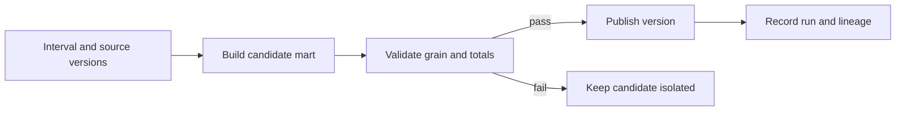

# Modeling, dbt, and orchestration: publish a meaningful dataset

Finance and sales use the same order data but report different daily revenue. Their SQL may handle duplicates and refunds differently.

**dbt** helps a team organize, run, test, and document shared data transformations, usually written in SQL. A **dbt model** is a transformation definition that produces an analytical table or view.

For an order report, the workflow might be:

1. Clean the loaded orders and check that order IDs are unique.
2. Calculate daily revenue using the agreed refund rules.
3. Check the result before publishing it.

The database stores the rows and executes the SQL. CDC collects source changes; dbt transforms loaded data. Airflow or Dagster coordinates when dependent tasks run. This coordination is called **orchestration**.

A successful run does not prove the revenue figure is right. Check what each row means, how history is handled, and whether consumers received the intended result.

## Terms introduced in this chapter

| Term | Meaning | Why it matters / when to use it |
|---|---|---|
| Fact / dimension | Facts store measurements or events such as sales. Dimensions describe them, such as the customer's region or product category. | Separate measurable events from descriptive context so aggregation and attribution stay meaningful. **Concrete situation (illustrative):** A sales report needs amounts alongside customer and product attributes. → Model sales events as facts and descriptive entities as dimensions at declared grains. → Check joins preserve the intended event count and totals. |
| Star schema | A table design that connects a fact table to its descriptive dimension tables through defined keys. | Give analytical queries explicit fact-to-dimension joins at declared grains. **Concrete situation (illustrative):** Every analyst reconstructs sales joins differently. → Publish a fact table with clearly related dimensions. → Verify common queries use consistent keys and avoid accidental duplication. |
| SCD Type 1 / Type 2 | Type 1 overwrites an old attribute. Type 2 keeps dated versions so reports can use the attribute that applied at the time. | Choose whether reports use today's attributes or the attributes valid when an event happened. **Concrete situation (illustrative):** A customer moves regions, and reports disagree about past sales attribution. → Choose overwrite semantics or dated history according to the reporting question. → Test whether old sales use current or historically valid attributes as intended. |
| Incremental model | A transformation that updates the selected new or changed data instead of rebuilding the entire result every time. | Avoid full recomputation when a correctly bounded change set can update the result. **Concrete situation (illustrative):** A daily transformation rereads the full history despite few changes. → Process new or changed records with an explicit key and late-update strategy. → Compare an incremental run with a full rebuild on a controlled fixture. |
| Backfill | Running a transformation again for a specified past period, for example to repair missing days. | Repair missing or corrected historical intervals without silently changing unrelated periods. **Concrete situation (illustrative):** A corrected business rule must be applied to three months of historical data. → Backfill the selected intervals with controlled load and idempotent writes. → Reconcile each interval and ensure scheduled runs do not conflict. |
| Data interval | The period a scheduled run must process, which can differ from the time the run actually starts. | Make scheduled work's time responsibility explicit so missing intervals and retries can be checked. **Concrete situation (illustrative):** A job triggered today is supposed to compute yesterday's business day. → Use its explicit data interval instead of the current wall clock. → Retry the run and confirm it still reads the same intended interval. |

## Understand the model first

1. Preserve a raw representation with source identities.
2. Standardize types, timestamps, units, and event versions in staging.
3. Build reusable transformations in intermediate models.
4. Publish facts, dimensions, and marts with explicit consumer definitions.
5. Gate publication on checks, then record the input versions and output identity.

Bronze, silver, and gold are organizational conventions. They do not enforce quality by naming a directory. Define each boundary: what is preserved, what is rejected, how historical corrections propagate, and who can read it.

## Build history deliberately

A fact at order-line grain can answer item revenue; a daily aggregate cannot necessarily reconstruct each order. Declare the grain before adding columns. For Type 2 dimensions, join a fact's event time against a non-overlapping validity interval, commonly using a half-open interval. Decide whether reports should reflect historical attribution or today's classification.

Consider a customer who moves regions on Tuesday. A Monday order may belong to Monday's region for historical reporting but today's region for a current-account view. Both can be useful; a single undocumented join cannot safely stand for both definitions.

## Fact grain, dimensions, and SCD history

An order-line fact can contain quantity and line amount; a customer dimension contains descriptive attributes. A star schema joins facts to dimensions through declared keys. Additive measures can be summed across their valid dimensions; an account balance is not generally additive across time, and an average price cannot be aggregated by averaging subgroup averages without weights. Define numerator and denominator for ratios in the semantic contract.

SCD Type 1 overwrites an attribute, so historical facts joined to the current dimension reflect today's classification. Type 2 creates a new dimension version with a surrogate identity and a validity interval. Half-open intervals `[valid_from, valid_to)` ensure an event exactly at the change instant joins to only the new version. Enforce no overlaps and define the handling of facts before the first known version.

The following runnable SQLite fixture makes the difference visible. Its small integer timestamps are synthetic ordered instants. A real model should use explicitly zoned timestamps and a tie-breaking source sequence.

<!-- executable: scd-history -->
```python
import sqlite3

with sqlite3.connect(':memory:') as db:
    db.executescript("""
    CREATE TABLE dim_customer(customer TEXT, region TEXT, start_at INT, end_at INT);
    INSERT INTO dim_customer VALUES ('c1','KR',0,20),('c1','US',20,100);
    CREATE TABLE facts(event TEXT, customer TEXT, event_at INT, cents INT);
    INSERT INTO facts VALUES ('e1','c1',10,100),('e2','c1',20,250);
    """)
    naive = db.execute('SELECT SUM(cents) FROM facts JOIN dim_customer USING(customer)').fetchone()[0]
    historical = db.execute("""
      SELECT region, SUM(cents) FROM facts f JOIN dim_customer d
      ON f.customer=d.customer AND f.event_at>=d.start_at AND f.event_at<d.end_at
      GROUP BY region ORDER BY region
    """).fetchall()
    current = db.execute("""
      SELECT region, SUM(cents) FROM facts f JOIN dim_customer d
      ON f.customer=d.customer AND d.end_at=100 GROUP BY region
    """).fetchall()
    assert naive == 700
    assert historical == [('KR',100),('US',250)]
    assert current == [('US',350)]
    print('naive_total:', naive)
    print('type_2_attribution:', historical)
    print('current_attribution:', current)
```

Expected output:

```text
naive_total: 700
type_2_attribution: [('KR', 100), ('US', 250)]
current_attribution: [('US', 350)]
```

The event at instant 20 belongs to US. Changing `< end_at` to `<= end_at` double-matches the boundary, an error a general non-null test will not catch. A late correction to the dimension may require rebuilding historical fact attribution, not only the current dimension row.

## dbt's role

`ref` connects model dependencies and relation names; `source` identifies external inputs. Models express transformations, macros share SQL-generation logic, snapshots support change-history workflows, and documentation explains meaning. Adapter and warehouse behavior determine available materializations and constraints.

A model contract describes output shape and supported constraints. A data test evaluates content and reports failing records after the relation exists. Declaring a primary key in a warehouse does not necessarily enforce uniqueness; inspect the adapter and platform behavior and retain an explicit uniqueness test where needed.

Here is an illustrative dbt model property file. It assumes an existing `fct_orders` model with these columns and a compatible dbt/adapter version. It is not a complete project:

```yaml
version: 2
models:
  - name: fct_orders
    description: One accepted current record per order event.
    columns:
      - name: event_id
        data_tests:
          - not_null
          - unique
      - name: amount_cents
        data_tests:
          - not_null
```

These checks do not validate currency, revenue definition, missing upstream events, or update history. Add fixture-based business tests, source reconciliation, and delivery checks for those questions.

## Models, ref, source, and macros

A dbt SQL model describes a SELECT whose materialization controls whether it becomes a view, table, incremental relation, or another adapter-supported object. `ref('stg_orders')` both resolves the upstream model's environment-specific relation and declares a graph dependency. `source('commerce','orders')` resolves an externally loaded relation registered in source properties; it does not perform ingestion. Hard-coding a production schema bypasses that environment/dependency benefit.

A macro generates SQL at compilation time. It is not a row-by-row Python function in the warehouse. Keep units in names so reuse preserves meaning. For example, save this in `macros/cents_to_units.sql` in a dbt project:

```sql

  cast({{ column_name }} as decimal(18,2)) / 100

```

Then `{{ cents_to_units('amount_cents') }}` produces an expression in a model. The argument is trusted project code, not arbitrary user SQL. A currency needing another scale requires another rule; a convenient macro must not silently impose two decimal places on all money.

## Incremental models: selecting changes and replacing keys

An incremental model has two separate responsibilities: select all relevant changes and apply them correctly to existing output. `is_incremental()` is true only under dbt's documented incremental conditions, including an existing target and no full refresh. A configured `unique_key` tells a supported strategy how to match records; it is not a promise that incoming keys are unique or non-null.

This model is a DuckDB/PostgreSQL-style SQL example for a dbt adapter supporting `delete+insert`. Save it as `models/fct_orders.sql` in an existing project with `stg_orders(event_id, amount_cents, updated_at, source_seq)`. Staging must reject conflicting payloads for the same event/sequence and retain the authoritative sequence. The two-day lookback is a fixture policy, not a universal lateness guarantee.

```sql
{{ config(materialized='incremental', unique_key='event_id',
          incremental_strategy='delete+insert') }}

with candidates as (
  select * from {{ ref('stg_orders') }}
  
  where updated_at >= (
    select coalesce(max(updated_at), timestamp '1900-01-01') from {{ this }}
  ) - interval '2 days'
  
), ranked as (
  select *, row_number() over (
    partition by event_id order by source_seq desc
  ) as position
  from candidates
)
select event_id, amount_cents, updated_at, source_seq
from ranked where position=1
```

The adapter replaces existing matching keys with selected current records. On the initial build, e1=100 and e2=250 give 350 cents. A newer e1 version of 120 should give 370 after the next build; another identical build stays at 370. Appending instead of replacing would produce 470. A correction with a source `updated_at` outside the lookback is missed, so the source must guarantee the change-detection clock or provide a CDC/control-position alternative. Tombstones require explicit delete processing; a SELECT that merely filters deleted rows cannot remove an already published target row.

Verify this in a disposable schema with `dbt run --select +fct_orders`, `dbt test --select fct_orders`, and a keyed comparison with a separately built full-refresh result. Preserve the source fixture, adapter/core versions, and compiled SQL. A successful incremental invocation is not evidence that historical deletions or late updates were covered.

## Snapshots, tests, contracts, and documentation

dbt snapshots preserve detected changes from a mutable source as Type 2 history. The timestamp strategy uses a reliable updated-at column; check-based comparison compares configured values. A daily snapshot sees the state at its runs, so two intermediate changes between runs can be absent from its history. CDC is required when every intermediate source change matters. Do not label snapshot observation time as business effective time without a source contract.

Use generic data tests for reusable assertions such as uniqueness and nullability, and singular SQL tests for a business invariant expressed as failing rows. A test returning no rows passes; this makes an empty model a possible false sense of success unless completeness is checked independently. For example, a singular test can return each fact with zero or multiple valid dimension matches. Unit fixtures test transformation logic against small controlled inputs before a full data build where the dbt version/adapter supports them.

A model contract constrains output columns/types and supported constraints at the model boundary. Constraint enforcement varies by warehouse. Documentation carries descriptions, grain, units, owners, and the meaning of tests; it cannot substitute for their execution. Store artifacts such as the manifest and run results with the release so lineage and test outcomes refer to the same revision. `dbt build` respects graph dependencies and supported test-blocking behavior, but it does not automatically make every model in the project one atomic publication transaction.

## Orchestrate intervals, not wall-clock guesses

Airflow expresses workflows and supports historical backfill with reprocessing and concurrency controls. Dagster is an alternative to evaluate when asset definitions and their dependencies are the preferred organizing model. Use one initially.

A task should process its explicit input interval rather than calling “now” throughout the transformation. Retries must target the same logical input and avoid duplicating external effects. Separate a run ID from a business interval: two attempts can process the same interval, while one interval must still have an unambiguous published result.



### Airflow DAGs and Dagster assets

An Airflow DAG expresses task dependencies. A logical date/data interval identifies the period of work; actual start time can be later because of scheduling or resource contention. A retry is another attempt at that interval. Explicitly pass interval boundaries and input versions into transformations, and use scheduler concurrency controls to keep a backfill from exhausting current-production capacity. Task success should follow durable output verification, not precede it.

Dagster's asset-oriented model names the datasets and their dependencies, with partitions representing slices such as dates. A materialization records an asset update, and checks can evaluate its properties. This can make “which partitions are missing?” more natural than reasoning only from task execution. Choose using the operating questions and integrations you need; neither model eliminates transactional publication, data contracts, or source retention.

If a task launches a warehouse query and times out while the query continues, starting another task attempt can create concurrent writers. Record the remote operation ID and reconcile its terminal state before issuing the same logical publication again. A scheduler retry policy is not a distributed cancellation protocol.

## Backfill exercise

Prerequisites: a disposable model/schema, three synthetic days of orders, and a scheduler or script that accepts explicit start/end times. Build all three days and record totals. Introduce a corrected order on day two. Reprocess only that interval into a candidate output, compare its expected totals, and publish it atomically using a supported mechanism.

Repeat the same backfill. The final result should remain identical. Then inject a failure after output creation but before the scheduler marks success. Reconcile the output identity on retry. Count active backfills and protect resources needed for current data; a successful historical repair that causes today's deadline to fail is incomplete recovery.

Incremental filtering on `max(event_time)` alone can miss a late correction with an older timestamp. Design a bounded lookback plus deterministic merging, CDC positions, or another source-supported change mechanism. Compare incremental output with a full rebuild on a fixture that includes late updates and deletes.

## Example results

Illustrative three-day ledger, all amounts in cents.

```text
baseline: day1=100, day2=250, day3=50
day2 correction: replace 250 with 270
after bounded backfill: day1=100, day2=270, day3=50
after identical retry: day1=100, day2=270, day3=50
full rebuild comparison: MATCH
```

A day-two value of 520 indicates additive replay. An unexplained change outside day two violates the repair scope. Include late deletes in the full-rebuild comparison and reconcile existing publication after a scheduler acknowledgment failure.

## Explain it in your own words

What exactly does your model's successful build prove? State its grain, interval, input versions, checks, publication boundary, and remaining uncertainty. Explain why retrying a task and republishing a business result are different operations.

Continue with [quality and SLOs](08-quality-contracts-slos.md).

<!-- source: https://docs.getdbt.com/docs/build/data-tests | checked: 2026-09-10 | model data tests -->
<!-- source: https://docs.getdbt.com/docs/mesh/govern/model-contracts | checked: 2026-09-10 | shape versus data tests and adapter constraint support -->
<!-- source: https://airflow.apache.org/docs/apache-airflow/stable/core-concepts/backfill.html | checked: 2026-09-10 | Airflow 3.3.1 backfill semantics at review -->
<!-- source: https://docs.getdbt.com/docs/build/incremental-models | checked: 2026-09-10 | change selection, unique_key and full refresh -->
<!-- source: https://docs.getdbt.com/docs/build/snapshots | checked: 2026-09-10 | timestamp/check strategies and observed history -->
<!-- source: https://docs.getdbt.com/docs/build/jinja-macros | checked: 2026-09-10 | SQL generation and macros -->
<!-- source: https://docs.dagster.io/guides/build/assets | checked: 2026-09-10 | assets, materializations and dependencies -->
