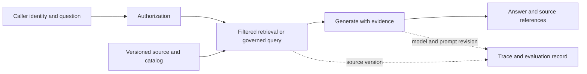

# AI-ready data, retrieval, and evaluation

An assistant needs more than clean rows. It needs discoverable meaning, authorized access, current evidence, stable source identities, and a way to report when it cannot answer reliably. This chapter uses “AI-ready” as an engineering checklist, not a certification or universal standard.

## Terms introduced in this chapter

| Term | Meaning | Why it matters / when to use it |
|---|---|---|
| Embedding | A numerical representation used for similarity-based retrieval | Retrieve semantically related candidates when wording differs from the query. **Concrete situation (illustrative):** A user searches for a concept using different wording from the document. → Encode query and passages with a compatible embedding setup. → Evaluate relevant retrieval on a labeled set rather than trusting vector proximity alone. |
| Hybrid retrieval | Combining lexical and vector-based retrieval signals | Combine exact-term strengths with semantic matches when either retrieval method alone misses evidence. **Concrete situation (illustrative):** Keyword search finds exact product codes, while semantic search finds paraphrases. → Combine lexical and vector retrieval with an explicit fusion strategy. → Compare coverage and ranking on both kinds of query. |
| Reranking | Reordering a candidate set using a more specific relevance model | Improve final relevance after a cheaper first-stage search has narrowed the candidate set. **Concrete situation (illustrative):** The right passage is retrieved but appears below several weak candidates. → Rerank a bounded candidate set using a relevance model. → Measure ranking improvement alongside added latency and cost. |
| RAG | Retrieval-Augmented Generation: supplying retrieved evidence to a generator | Supply source-specific evidence for answers while checking authorization, citation support, and evaluation. **Concrete situation (illustrative):** A support assistant needs answers grounded in current internal documentation. → Retrieve authorized passages and supply them with the question to the generator. → Check answer support, citations, and behavior when evidence is missing. |
| Semantic layer | Governed definitions of metrics and their allowed dimensions/relationships | Keep business metrics consistent across dashboards and generated queries. **Concrete situation (illustrative):** Finance and sales dashboards use different revenue formulas. → Define shared metrics, dimensions, and business rules in a semantic layer. → Reconcile both dashboards against the same controlled examples. |
| Evaluation set | Versioned examples and expected criteria used to assess behavior | Reproduce candidate comparisons and avoid judging improvements from a few favorable examples. **Concrete situation (illustrative):** A retrieval change looks better on a few hand-picked questions. → Evaluate it on a versioned set covering realistic successes and failures. → Compare per-category outcomes and investigate regressions before release. |

## Understand the model first

1. Register the source's meaning, owner, version, quality status, and access policy.
2. Produce derived chunks or structured query interfaces with source references.
3. Retrieve only evidence the caller is authorized to use.
4. Generate an answer or execute an allowed tool operation under a separate policy.
5. Record the application version and evidence needed for debugging and evaluation.



Treat retrieved text as data, even if it contains instructions. A source document cannot grant itself access or authorize a tool call. MCP and tool-calling interfaces can describe or expose capabilities; enforcement belongs to the server/application identity and policy boundary. Connect this to the existing [enterprise agent operations chapter](../../../docs-site/content/ai-transformation-platform/04-enterprise-agent-operations.md).

## Prepare reproducible structured and unstructured inputs

For structured data, define metrics such as “revenue” through grain, currency, cancellation policy, and time basis. A semantic layer can reduce disagreement among consumers, but its definitions still need owners and tests. Use a knowledge graph or ontology when explicit entities and relationships improve a named query; adding graph storage alone does not create reliable meaning.

For documents, preserve source ID, version, section, content hash, classification, and permissions through extraction and chunking. Store the chunking and embedding revisions with the index version. Deleting or changing a source requires a corresponding update to chunks, embeddings, caches, and relevant evaluation fixtures.

Choose chunk sizes by retrieval experiments on representative questions. Very small chunks can lose context; very large chunks can bring irrelevant or conflicting text. Compare lexical retrieval, vectors, hybrid retrieval, and reranking against the same labeled candidate set. Metadata filtering should respect caller access, source status, and valid versions.

## Separate retrieval quality from answer quality

| Layer | Useful measurements | Important limit |
|---|---|---|
| Retrieval | Recall@k, ranking quality, authorized-source coverage | Requires a relevant, versioned reference set |
| Generation | Supported claims, task correctness, refusal/abstention behavior | A fluent answer is not evidence of correctness |
| Tools | Authorized success, argument validity, duplicated effects | A successful API call may still produce the wrong business outcome |
| Operations | Latency, errors, token use, cost per successful task | Low cost can coincide with poor task completion |

Do not let a model grade itself into production without calibration. Model-based judges are useful measurements when checked against human-reviewed examples and known failures; their agreement is not independent factual evidence. Keep training/tuning examples separate from a held-out evaluation set, and report sample sizes and uncertainty rather than a bare winning score.

## OTel, MLflow, and Langfuse

Use bounded spans for retrieval, model calls, tool calls, and application steps. Link source/index version, prompt revision, model identifier, and evaluation-set version in a controlled record. MLflow offers tracing and evaluation workflows; Langfuse offers application tracing and evaluation-related workflows. Choose one initially based on the lifecycle you need to operate. If both are used, document which owns each record and avoid accidental duplicate instrumentation and capture.

The OpenTelemetry GenAI conventions are evolving; at this review, the earlier main-site page points to a separate GenAI semantic-conventions repository. Pin the actual convention version used by your instrumentation and verify receiver/backend compatibility. Do not assume a blog example, SDK attribute set, and backend dashboard share the same schema.

Prompts and responses can contain sensitive material. For the course, use synthetic documents and questions. In a real deployment, decide whether to record content, redact it, hash references, or retain only metadata before enabling automatic capture. Limit retention and access to captured content and evaluation datasets.

## Embeddings and vector search: similarity is a retrieval hypothesis

An embedding model maps an input to a vector in a model-specific space. The query and documents must use compatible models and preprocessing. Cosine similarity is `dot(q,d) / (norm(q) × norm(d))`; for unit-normalized vectors it equals the dot product. Changing the model, dimension, normalization, or distance metric changes the retrieval contract. A cosine score of 0.9 is not a 90% probability that a passage is correct.

Exact nearest-neighbor search scores the eligible corpus directly. Approximate indexes such as HNSW navigate a graph of nearby vectors; IVFFlat narrows work through a partitioned search structure. Their speed/recall tradeoffs depend on index construction and search settings. Measure ANN neighbor recall against exact search separately from evidence relevance against human-labeled questions: perfect vector-neighbor recall can still retrieve irrelevant evidence if the embedding space ranks it poorly.

Selective metadata filters can change both performance and result count. If an approximate search retrieves ten candidates and only one survives a later access filter, asking for top ten has not produced ten authorized candidates. Use the engine's supported filtering/search strategy and enough candidate exploration while preserving access enforcement. Never let forbidden candidates reach the model or a user-visible debug trace while trying to fill the result set.

## Lexical search, hybrid fusion, and reranking

Lexical retrieval is valuable for exact identifiers, error codes, and rare terms. Vector retrieval can recover semantic similarity when wording differs. Hybrid search combines these signals. Their raw scores have different scales, so adding an arbitrary vector score to a lexical score can let one dominate. Reciprocal rank fusion (RRF) instead sums `1 / (constant + rank)` for each ranking where a document appears. Its constant and candidate-window sizes remain evaluation choices.

A reranker scores the query jointly with each candidate or applies another relevance model to the candidate set. It can improve ordering but cannot recover a passage that neither retriever returned. Increasing the candidate pool can improve coverage while raising reranking latency and cost. Compare retrieval coverage before attributing an answer failure to generation.

The following standard-library fixture uses invented two-dimensional vectors and an explicit lexical ranking, not a learned embedding model or a search-engine benchmark. Authorization is applied before scoring/selecting vector candidates and before fusion of the lexical candidates.

<!-- executable: hybrid-retrieval -->
```python
from math import sqrt

vectors = {'a': (1,0), 'b': (0.8,0.6), 'c': (0,1), 'private': (1,0)}
allowed = {'a','b','c'}
query = (1,0)
def cosine(a,b):
    return sum(x*y for x,y in zip(a,b)) / (
        sqrt(sum(x*x for x in a))*sqrt(sum(y*y for y in b)))

vector_rank = sorted(allowed, key=lambda key: (-cosine(query,vectors[key]),key))
lexical_rank = [key for key in ['private','b','c','a'] if key in allowed]
scores = {key:0.0 for key in allowed}
for ranking in (vector_rank,lexical_rank):
    for position,key in enumerate(ranking,1):
        scores[key] += 1/(60+position)
ranked = sorted(scores,key=lambda key:(-scores[key],key))
top = ranked[:2]
relevant = {'a','b'}
recall = len(set(top)&relevant)/len(relevant)
assert vector_rank == ['a','b','c']
assert top == ['b','a'] and recall == 1
assert 'private' not in scores
print('vector_rank:', vector_rank)
print('hybrid_top_2:', top)
print(f'recall_at_2={recall:.1f} forbidden_candidates=0')
```

Expected output:

```text
vector_rank: ['a', 'b', 'c']
hybrid_top_2: ['b', 'a']
recall_at_2=1.0 forbidden_candidates=0
```

Document b wins because it ranks near the top of both lists. This verifies fusion math and the fixture's allowed-set boundary, not a production authorization server. Add identity/policy integration tests separately. A forbidden document should fail the gate even if a later generation step happens not to quote it.

## Chunking, metadata filtering, and index versioning

Chunking chooses the retrieval unit. Split on meaningful sections where possible, preserve headings and source offsets, and keep a table's header associated with its values. Overlap can preserve context across boundaries but creates duplicated evidence; adjacent overlapping chunks should not count as independent supporting sources. Token limits belong to the actual tokenizer/model, not a universal character-to-token constant.

Keep `source_id`, source version/hash, chunk ID, section/offset, classification, allowed-use metadata, chunker revision, and embedding revision together. Build a new index version, evaluate it, then switch the serving reference under a controlled rollout. An index containing half old and half new chunk definitions can make evaluation and deletion hard to reproduce.

Metadata filtering also enforces valid time and publication status. A newer draft policy must not outrank an older approved policy when the user asks for the current approved rule. On revocation, update source authorization and derivatives/caches, then test retrieval, prompt construction, final output, and debugging views. A correct source ACL is insufficient if a cached answer bypasses it.

## Semantic layer, ontology, and knowledge graph

A semantic layer defines business metrics and their permitted dimensions/joins. For “revenue,” specify whether the grain is order or line, whether cancellations and refunds are subtracted, the currency/conversion policy, and the reporting timezone. The same query text can otherwise answer two different questions. Expose a governed metric operation to an agent instead of requiring it to reconstruct business meaning from column names every time.

An ontology defines entity types and relationship meanings: an order belongs to a customer; a dataset is produced by a job; a policy applies to a data class. A knowledge graph stores particular entities/relationships under that model. Distinguish an asserted relationship with source/version evidence from one inferred by a model. Graph traversal can identify a chain to investigate, but a path by itself does not prove the linked claims.

Choose graph retrieval for a named multi-hop question, such as finding consumers of datasets containing a classified field. Keep the original source passage or system record available for verification. A vector neighbor answers similarity; a typed edge answers a declared relation. Neither should silently substitute for the other.

## MCP, tool calling, and bounded agent execution

Tool calling describes an operation and structured arguments that a model can request. MCP standardizes a client/server interface for discovering and invoking supported capabilities. The protocol does not decide that a caller may read a dataset, that generated SQL is safe, or that a repeated operation should run twice. Authenticate the caller and enforce policy at the service boundary.

For a read-only revenue tool, expose a constrained argument schema such as dataset/metric identity, date interval, and permitted grouping dimensions. Validate the metric against an allowlist, parameterize values, restrict query resources, and return the publication/source version with the result. A SQL `LIMIT` bounds returned rows, not necessarily scanned bytes or join work. The service should enforce its actual query/time/cost budget.

An agent adds a control loop: plan a step, call an allowed tool, inspect a result, then continue or stop. Bound total steps, wall time, token/cost use, and retries. Treat retrieved instructions as content; they cannot grant a new tool privilege. Writes need a separately authorized operation and an idempotency identity, with reconciliation after uncertain timeouts. Log the decision/result reference without automatically retaining every prompt or sensitive row.

## Evaluate retrieval, answers, tools, and operations separately

Recall@k measures relevant reference items found in the first k results divided by all relevant reference items. Precision@k measures how many of those k results are relevant. Reciprocal rank focuses on the first relevant result; nDCG supports graded relevance with a rank discount. Specify whether the unit is a source document or chunk so overlapping chunks do not inflate the score.

For answers, measure supported factual claims, task correctness, and appropriate abstention on unanswerable or unauthorized questions. Report answered accuracy together with answer coverage; refusing everything gives no useful service despite avoiding incorrect answers. Slice results by fresh/stale sources, long documents, exact identifiers, access restrictions, and multi-hop questions. Keep a held-out evaluation set after prompt/retriever tuning and record sample size and uncertainty.

For tools, test argument validation, permitted effects, duplicate execution, timeout reconciliation, and source/result version identity. For operations, separate queue time, retrieval, reranking, model time-to-first-token, total generation time, and tool duration. Token totals are not interchangeable with latency, and cost per attempted request can improve simply because more requests fail early.

### MLflow and Langfuse records that support a regression decision

An evaluation record should bind the application bundle to the dataset: code revision, prompt template, model identifier, generation settings, corpus/index, chunker/embedding, policy version, and evaluation-set revision. Store each question's authorized reference evidence and observed outcome. MLflow's tracing/evaluation and Langfuse's traces/observations/scores can organize that lifecycle, but a score is a measurement under a rubric, not factual authority.

Use the same reviewed examples to calibrate a model judge, including plausible unsupported answers and correct abstentions. Keep judge version/prompt and human disagreement records. A mean score increase can hide an access leak or a regression on a critical slice. Release only when the defined hard gates pass and the relevant quality/operational tradeoff is acceptable.

## Failure exercise and interpretation

Create ten synthetic questions with explicit expected evidence, including an unanswerable question, a forbidden document, an outdated version, and a document containing instruction-like text. Record the expected allowed sources. Run retrieval alone first and compare candidate coverage. Then run generation and check whether claims cite the retrieved evidence or abstain when evidence is absent.

Remove access to one source, refresh the derivative index/policy state, and repeat as the restricted caller. The source must not appear in retrieval results, prompts, answers, or exposed debugging views. Change a source value and verify that a new answer can be traced to the updated version while the previous evaluation remains reproducible under its retained fixture policy.

## Example results

Illustrative evaluation receipt, not measured model performance.

```text
questions: 10
answered: 7
supported correct answers: 6
abstained: 3
answered accuracy: 6 / 7
answer coverage: 7 / 10
forbidden-source exposure: 0 required
```

Report coverage and answered accuracy together. A forbidden source in a prompt or debug view fails the access gate even if the final answer omits it. Grade against authorized evidence for each question, not another model's agreement.

## Explain it in your own words

If an answer is wrong, what evidence distinguishes stale data, retrieval failure, an ambiguous metric definition, a prompt defect, and a model error? Explain why a trace can help diagnose the case without proving the answer is true.

Continue with [platform operations](14-platform-operations.md).

<!-- source: https://mlflow.org/docs/latest/genai/tracing/ | checked: 2026-09-10 | tracing and evaluation workflow -->
<!-- source: https://langfuse.com/docs/observability/overview | checked: 2026-09-10 | application tracing responsibilities -->
<!-- source: https://opentelemetry.io/docs/specs/semconv/gen-ai/ | checked: 2026-09-10 | relocation notice; verify active convention repository before implementation -->
<!-- source: https://github.com/pgvector/pgvector | checked: 2026-09-10 | exact versus approximate search and filtering -->
<!-- source: https://www.elastic.co/docs/reference/elasticsearch/rest-apis/reciprocal-rank-fusion | checked: 2026-09-10 | rank fusion formula; example is original fixture -->
<!-- source: https://modelcontextprotocol.io/specification/2025-06-18/server/tools | checked: 2026-09-10 | explicitly scoped protocol version and tool boundary -->
