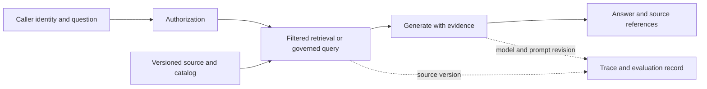

# AI-ready data, retrieval, and evaluation

An assistant needs more than clean rows. It needs discoverable meaning, authorized access, current evidence, stable source identities, and a way to report when it cannot answer reliably. This chapter uses “AI-ready” as an engineering checklist, not a certification or universal standard.

## Terms introduced in this chapter

| Term | Meaning |
|---|---|
| Embedding | A numerical representation used for similarity-based retrieval |
| Hybrid retrieval | Combining lexical and vector-based retrieval signals |
| Reranking | Reordering a candidate set using a more specific relevance model |
| RAG | Retrieval-Augmented Generation: supplying retrieved evidence to a generator |
| Semantic layer | Governed definitions of metrics and their allowed dimensions/relationships |
| Evaluation set | Versioned examples and expected criteria used to assess behavior |

## Understand the model first

1. Register the source's meaning, owner, version, quality status, and access policy.
2. Produce derived chunks or structured query interfaces with source references.
3. Retrieve only evidence the caller is authorized to use.
4. Generate an answer or execute an allowed tool operation under a separate policy.
5. Record the application version and evidence needed for debugging and evaluation.

Treat retrieved text as data, even if it contains instructions. A source document cannot grant itself access or authorize a tool call. MCP and tool-calling interfaces can describe or expose capabilities; enforcement belongs to the server/application identity and policy boundary. Connect this to the existing [enterprise agent operations chapter](../../../docs-site/content/ai-transformation-platform/04-enterprise-agent-operations.md).

## Prepare reproducible structured and unstructured inputs

For structured data, define metrics such as “revenue” through grain, currency, cancellation policy, and time basis. A semantic layer can reduce disagreement among consumers, but its definitions still need owners and tests. Use a knowledge graph or ontology when explicit entities and relationships improve a named query; adding graph storage alone does not create reliable meaning.

For documents, preserve source ID, version, section, content hash, classification, and permissions through extraction and chunking. Store the chunking and embedding revisions with the index version. Deleting or changing a source requires a corresponding update to chunks, embeddings, caches, and relevant evaluation fixtures.

Choose chunk sizes by retrieval experiments on representative questions. Very small chunks can lose context; very large chunks can bring irrelevant or conflicting text. Compare lexical retrieval, vectors, hybrid retrieval, and reranking against the same labeled candidate set. Metadata filtering should respect caller access, source status, and valid versions.

## Separate retrieval quality from answer quality

| Layer | Useful measurements | Important limit |
|---|---|---|
| Retrieval | Recall@k, ranking quality, authorized-source coverage | Requires a relevant, versioned reference set |
| Generation | Supported claims, task correctness, refusal/abstention behavior | A fluent answer is not evidence of correctness |
| Tools | Authorized success, argument validity, duplicated effects | A successful API call may still produce the wrong business outcome |
| Operations | Latency, errors, token use, cost per successful task | Low cost can coincide with poor task completion |

Do not let a model grade itself into production without calibration. Model-based judges are useful measurements when checked against human-reviewed examples and known failures; their agreement is not independent factual evidence. Keep training/tuning examples separate from a held-out evaluation set, and report sample sizes and uncertainty rather than a bare winning score.

## OTel, MLflow, and Langfuse

Use bounded spans for retrieval, model calls, tool calls, and application steps. Link source/index version, prompt revision, model identifier, and evaluation-set version in a controlled record. MLflow offers tracing and evaluation workflows; Langfuse offers application tracing and evaluation-related workflows. Choose one initially based on the lifecycle you need to operate. If both are used, document which owns each record and avoid accidental duplicate instrumentation and capture.

The OpenTelemetry GenAI conventions are evolving; at this review, the earlier main-site page points to a separate GenAI semantic-conventions repository. Pin the actual convention version used by your instrumentation and verify receiver/backend compatibility. Do not assume a blog example, SDK attribute set, and backend dashboard share the same schema.

Prompts and responses can contain sensitive material. For the course, use synthetic documents and questions. In a real deployment, decide whether to record content, redact it, hash references, or retain only metadata before enabling automatic capture. Limit retention and access to captured content and evaluation datasets.

## Failure exercise and interpretation

Create ten synthetic questions with explicit expected evidence, including an unanswerable question, a forbidden document, an outdated version, and a document containing instruction-like text. Record the expected allowed sources. Run retrieval alone first and compare candidate coverage. Then run generation and check whether claims cite the retrieved evidence or abstain when evidence is absent.

Remove access to one source, refresh the derivative index/policy state, and repeat as the restricted caller. The source must not appear in retrieval results, prompts, answers, or exposed debugging views. Change a source value and verify that a new answer can be traced to the updated version while the previous evaluation remains reproducible under its retained fixture policy.

## Explain it in your own words

If an answer is wrong, what evidence distinguishes stale data, retrieval failure, an ambiguous metric definition, a prompt defect, and a model error? Explain why a trace can help diagnose the case without proving the answer is true.

Continue with [platform operations](14-platform-operations.md).

<!-- source: https://mlflow.org/docs/latest/genai/tracing/ | checked: 2026-09-10 | tracing and evaluation workflow -->
<!-- source: https://langfuse.com/docs/observability/overview | checked: 2026-09-10 | application tracing responsibilities -->
<!-- source: https://opentelemetry.io/docs/specs/semconv/gen-ai/ | checked: 2026-09-10 | relocation notice; verify active convention repository before implementation -->
